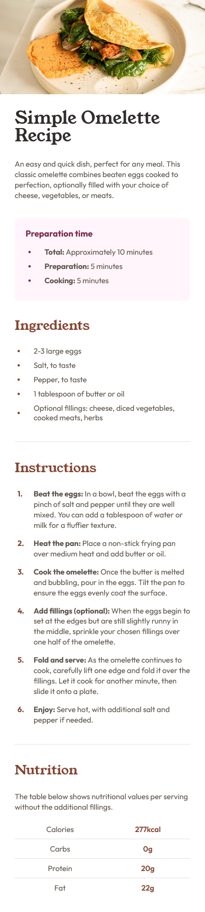
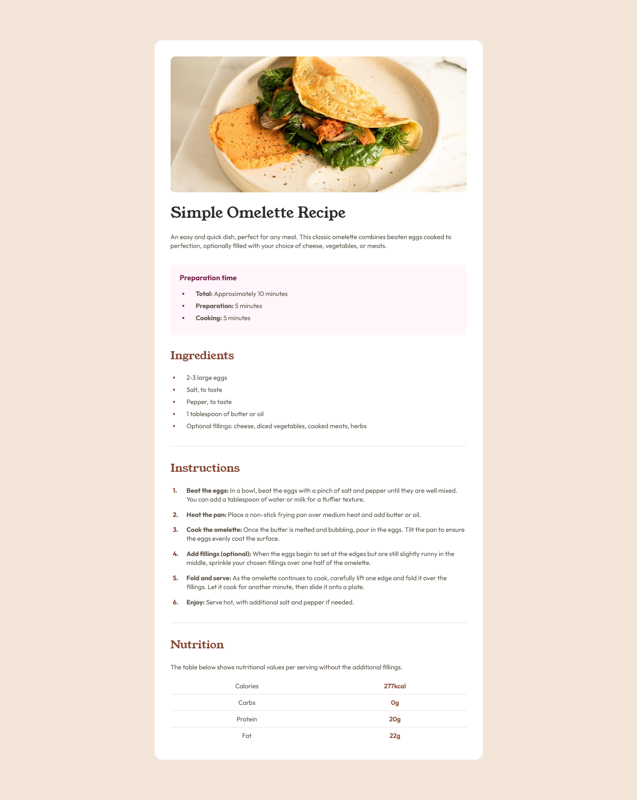

## Overview
This is a front-end mentor challenge called recipe page main

### Screenshot
Mobile view

desktop view

## My process
    I use block process

### Built with
- Semantic HTML5 markup
- CSS custom properties
- Mobile-first workflow

